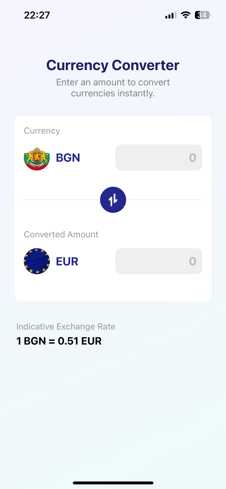
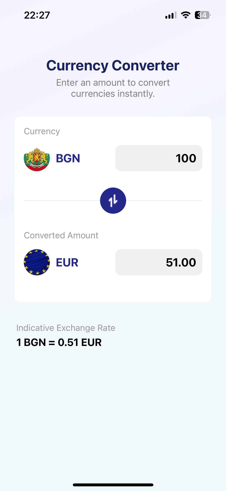
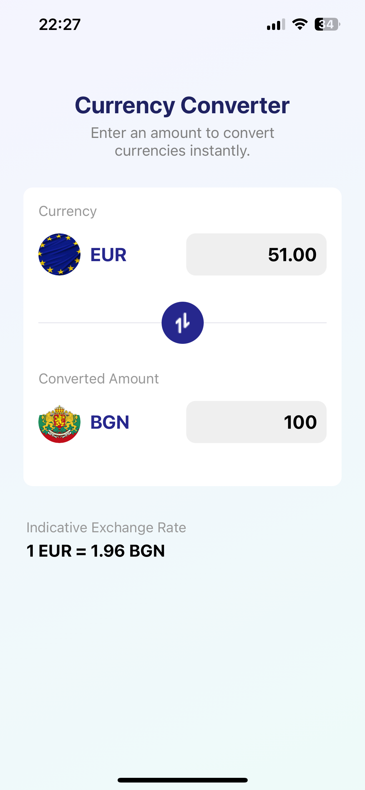

# Currency Converter App

📱 <strong>Description</strong> 
A simple React Native application for converting between two currencies. Users can enter an amount in the main currency, instantly see the converted value, and switch between currencies with a single tap.

🎨 <strong>Design</strong> 
The UI design is based on a Figma community file: 
https://www.figma.com/community/file/1215141639571590423/currency-converter

🖼️ <strong>Screenshots</strong> 
Here is a preview of the application interface:  
  
